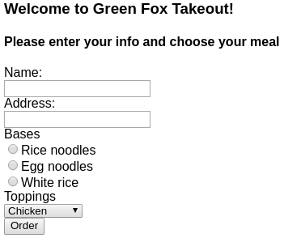

# Green Fox Takeout :ramen:

We are going to create our very own online restaurant where guests can customize
their orders based on their preferences. :stew:

**Please read the whole description in order to understand the application.**

## `GET /`

- The main page should be rendered

- It should contain a form that has:

  - Two input fields with labels
  - One radio button-type selector
  - One drop-down menu

  

- The base options should be `rice noodles` `egg noodles` and `white rice`

- The topping options should be `chicken` `beef` and `smoked tofu`

- The customer can choose only one of each

- The form should be submitted to `POST /api/orders`

- After submission based on the response display the order id below the form and
  clear the input fields

## `POST /api/orders`

- After saving the order in the database respond with the stored order in the
  following JSON format

  ```json
    {
      "id": 2,
      "name": "István Kárász",
      "address": "Andrassy street 66",
      "base": "white rice",
      "topping": "smoked tofu",
      "status": "ordered"
    }
  ```

## `GET /api/orders/{orderId}`

- It should respond with the stored entry in the following JSON format

   ```json
    {
      "id": 2,
      "name": "István Kárász",
      "address": "Andrassy street 66",
      "base": "white rice",
      "topping": "smoked tofu",
      "status": "ordered"
    }
  ```

- In case the order ID does not exist, the application should respond with 404
  status code

## `GET /api/orders?status=[string]`

- Valid `status` values are

  - `ordered`
  - `inprogress`
  - `done`

- This endpoint should respond in JSON format with those
  orders only that are still in progress

  ```json
  [
    {
      "id": 2,
      "name": "István Kárász",
      "address": "Andrassy street 66",
      "base": "white rice",
      "topping": "smoked tofu",
      "status": "inprogress"
    },
    {
      "id": 5,
      "name": "Tamás Kökény",
      "address": "Andrassy street 666",
      "base": "egg noodles",
      "topping": "smoked tofu",
      "status": "inprogress"
    }
  ]
  ```

- The `status` query string in the URL is required. The endpoint should return with `422` status
  code in case the status is not valid

- For example, if no `ordered` status was found then the `/api/orders?status=ordered` should return with empty list:

```json
  []
```

## `PATCH /api/orders/{orderId}`

- The order status should be in the request's body in JSON format, this is how
  we will be able to modify its progress

  ```json
  {
    "status": "inprogress"
  }
  ```

- If there is no order with the specified id then it should return with `404`
- If the status is not valid it should respond with `422` status code

- Valid status values are

  - `ordered`
  - `inprogress`
  - `done`

## SQL

Given the following table named `applicants`.

| id | name               | country_id | age |
|:---|:-------------------|:-----------|:----|
| 1  | Bořivoj Souček     | 1          | 24  |
| 2  | Papp Patrícia      | 2          | 33  |
| 3  | Kocsis Ivett       | 2          | 37  |
| 4  | Slavomír Vykukal   | 1          | 20  |
| 5  | Bruno Malík        | 1          | 31  |
| 6  | Veronika Lukešová  | 1          | 18  |
| 7  | Székely Miklós     | 2          | 29  |
| 8  | Hegedüs Benjámin   | 2          | 37  |
| 9  | Nela Machová       | 1          | 20  |
| 10 | Balog Rajmund      | 2          | 39  |
| 11 | Major Borbála      | 2          | 35  |
| 12 | Evelína Horváthová | 1          | 23  |
| 13 | Vászoly Vivien     | 2          | 40  |
| 14 | Lada Stýskalová    | 1          | 27  |
| 15 | Dagmar Benešová    | 1          | 33  |

Given the following table named `countries`.

| id | country        |
|:---|:---------------|
| 1  | Czech Republic |
| 2  | Hungary        |


`1.` Write SQL query to insert a new applicant

  ```sql

  ```

`2.` Write SQL query that will return the youngest applicant's name

  ```sql

  ```

`3.` Write SQL query to update the `Czech Republic` country to `Czech Republic or Slovakia`

  ```sql

  ```

`4.` Write SQL query to select the name and the country of applicants from
Hungary with the age 40.

  ```sql

  ```

The expected result should be the following.

| name           | country |
|:---------------|:--------|
| Vászoly Vivien | Hungary |
